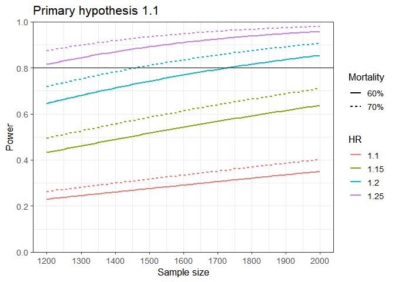
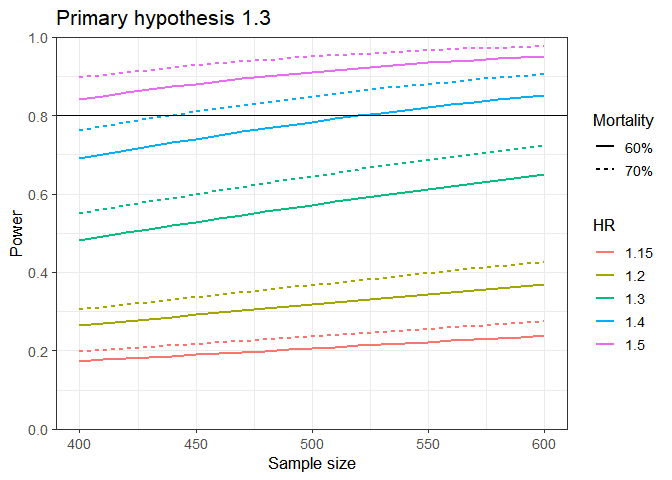
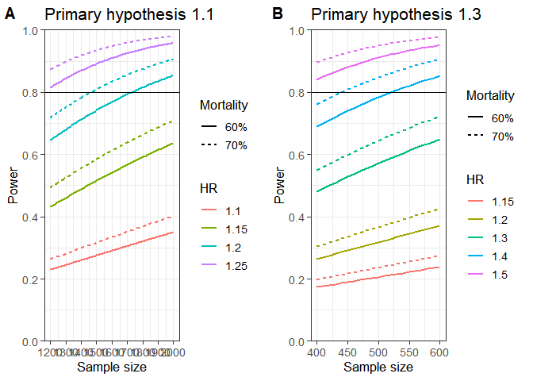

Power Calculation - Melanoma sex differences
================
Kaitlyn Tsuruda
8/20/26

- <a href="#about" id="toc-about">About</a>
- <a href="#set-up" id="toc-set-up">Set up</a>
- <a
  href="#hypothesis-1.1-patients-with-stage-iiiiv-melanoma-treated-with-first-line-anti-pd-1-monotherapy"
  id="toc-hypothesis-1.1-patients-with-stage-iiiiv-melanoma-treated-with-first-line-anti-pd-1-monotherapy">Hypothesis
  1.1 (patients with stage III/IV melanoma treated with first line
  anti-PD-1 monotherapy)</a>
  - <a href="#power-calculation" id="toc-power-calculation">Power
    calculation</a>
- <a
  href="#hypothesis-1.3-patients-diagnosed-with-primary-stage-iv-melanoma"
  id="toc-hypothesis-1.3-patients-diagnosed-with-primary-stage-iv-melanoma">Hypothesis
  1.3 (patients diagnosed with primary stage IV melanoma)</a>
  - <a href="#pre-ici-period-2010-2013"
    id="toc-pre-ici-period-2010-2013">Pre-ICI period (2010-2013)</a>
  - <a href="#ici-period-2016-2021" id="toc-ici-period-2016-2021">ICI period
    (2016-2021)</a>
  - <a href="#combined-data-2010-2013-and-2016-2021"
    id="toc-combined-data-2010-2013-and-2016-2021">Combined data (2010-2013
    and 2016-2021)</a>
  - <a href="#power-calculation-1" id="toc-power-calculation-1">Power
    calculation</a>
- <a href="#figure-included-in-supplemental-material-appendix-a8"
  id="toc-figure-included-in-supplemental-material-appendix-a8">Figure
  included in supplemental material (Appendix A8)</a>
- <a href="#session-and-citation-information"
  id="toc-session-and-citation-information">Session and citation
  information</a>

## About

This document performs the power calculations presented in
*Sex-disparities in survival after anti-PD-1 monotherapy for advanced
melanoma in Norway: a population-based cohort study \[Registered
Report - stage I\].*

For all analyses, we assume that the distribution of age, sex and
melanoma-specific death will be the same as reported in [Reis Costa D,
Winge-Main AK, Skog A, Tsuruda KM, Robsahm TE, Kulle Andreassen B. From
trials to practice: Immune checkpoint inhibitor therapy for melanoma
patients in Norway. Acta Oncol.
2024;63:965-73.](https://doi.org/10.2340/1651-226X.2024.41266) We
therefore use the data prepared from this publication in our power
calculations, which contains information about cutaneous melanoma
diagnoses until the end of 2021. These data cannot be shared publicly
due to privacy restrictions.

## Set up

We use the `powerSurvEpi` package for this calculation, which provides
functions for power and sample size calculations for survival analyses
in epidemiological studies using Cox proportional hazards regression
models.

``` r
library(cowplot)
library(data.table)
library(ggplot2)
library(here)
library(knitr)
library(powerSurvEpi)
library(sessioninfo)
library(tidyverse)

setwd(here())
```

## Hypothesis 1.1 (patients with stage III/IV melanoma treated with first line anti-PD-1 monotherapy)

The analyses associated with hypothesis 1.1 will quantify sex-based
survival disparities among those treated in the ICI period (2016-2024).
We hypothesize that females will have higher net survival than males.

This analysis will include patients diagnosed with advanced cutaneous
melanoma who were \>=18 years old when treated with first-line
palliative anti-PD-1 monotherapy during 2016-2024.

``` r
load("./Data/rwdPop1L.RData")

#Check only one observation in dataset per person
nrow(idImmFirstCM) == nrow(distinct(idImmFirstCM, PID)) 
```

    [1] TRUE

``` r
#dataset already includes patients with advanced melanoma treated with 1L ICI, so
#keep data for patients >= 18, treated with anti-PD-1 monotherapy during 2016-2021
ICI_dat <- idImmFirstCM %>% 
      filter(ALDER >= 18) %>% 
      filter(between(yrFirstImm, 2016, 2021)) %>% 
      filter(eventtype == "Nivo" | eventtype == "Pemb") 
```

There were 1198 patients with advanced melanoma and treated with first
line palliative anti-PD-1 monotherapy during 2016-2021. The annual
number of patients starting 1L treatment was as follows:

| 2016 | 2017 | 2018 | 2019 | 2020 | 2021 |
|-----:|-----:|-----:|-----:|-----:|-----:|
|  176 |  160 |  190 |  209 |  247 |  216 |

Overall, we estimate that we will include the 1198 patients described
above, plus an additional 125 patients per year from 2022-2024, for a
total of 1573 patients in our planned analyses.

### Power calculation

We perform power calculations for various combinations of

- sample size (1200 to 2000, by intervals of 10)

- observed HR (1.15, 1.2, 1.3, 1.4, and 1.5)

- probability of death (60% or 70%)

These calculations assume the use of a Cox proportional hazards
regression model with 2 covariates. The first covariate is our exposure
of interest, sex, and for the other we will use age.

``` r
#vector for sample sizes under consideration
n_vector <- seq(1200, 2000, by = 10)

set.seed(29307648) #19037
#create numeric variable for sex and "fail" variables with 60 or 70% prevalance 
ICI_dat <- ICI_dat %>% mutate(sex = case_when(KJOENN == "M" ~ 0,
                                      KJOENN == "K" ~ 1),
                      fail60 = rbinom(nrow(ICI_dat), size = 1, p = 0.6),
                      fail70 = rbinom(nrow(ICI_dat), size = 1, p = 0.7))
  

#check prevalence in failure variables
kable(
summarize(ICI_dat, 
          n = n(), 
          mean_fail60 = mean(fail60), 
          mean_fail70 = mean(fail70)
          )
)
```

|    n | mean_fail60 | mean_fail70 |
|-----:|------------:|------------:|
| 1198 |   0.5951586 |   0.7036728 |

``` r
#60% mortality
for(beta in c(1.1, 1.15, 1.2, 1.25, 1.3, 1.4, 1.5)){
  assign(paste0("power1_HR", beta), 
           powerEpi(ICI_dat$sex, 
                   ICI_dat$ALDER, 
                   failureFlag = ICI_dat$fail60,
                   n = n_vector,
                   theta = beta,
                   alpha = 0.05)$power)
}

  
powerdat60_1 <-as.data.frame(cbind(n_vector, 
                               power1_HR1.1,
                               power1_HR1.15, 
                               power1_HR1.2, 
                               power1_HR1.25))

powerdat_long60_1 <- powerdat60_1 %>% 
                  pivot_longer(!n_vector, names_to = "HR") %>% 
                  mutate(HR = str_remove(HR, "power1_HR"),
                         Mortality = "60%")

#70% mortality
for(beta in c(1.1, 1.15, 1.2, 1.25, 1.3, 1.4, 1.5)){
  assign(paste0("power1_HR", beta), 
           powerEpi(ICI_dat$sex, 
                   ICI_dat$ALDER, 
                   failureFlag = ICI_dat$fail70,
                   n = n_vector,
                   theta = beta,
                   alpha = 0.05)$power)
}

  
powerdat70_1 <-as.data.frame(cbind(n_vector, 
                               power1_HR1.1,
                               power1_HR1.15, 
                               power1_HR1.2, 
                               power1_HR1.25))

powerdat_long70_1 <- powerdat70_1 %>% 
                  pivot_longer(!n_vector, names_to = "HR") %>% 
                  mutate(HR = str_remove(HR, "power1_HR"),
                         Mortality = "70%")
```

``` r
#combine power calculation data based on assumption of 60% and 70% mortality 
plot_dat1 <- rbind(powerdat_long60_1, powerdat_long70_1)

plot1.1 <- ggplot(data = plot_dat1, aes(x = n_vector, 
                                    y = value, 
                                    color = HR,
                                    linetype = Mortality)) +
          geom_line(linewidth = 1) +
          geom_hline(yintercept = 0.8) +
          ylab("Power") +
          xlab("Sample size") +
          ggtitle("Primary hypothesis 1.1") +
          scale_y_continuous(breaks = seq(0.0, 1, by = 0.2), 
                             expand = c(0, 0),
                             limits = c(0, 1)) +
          scale_x_continuous(breaks = seq(1200, 2000, by = 100),
                             limits = c(1200, 2000)) +
          theme_bw(base_size = 13)
plot1.1
```



We have 80.0043335% power to detect an effect size of 1.193 for 1575
patients with 70% mortality.

And 79.8588167% power to detect an effect size of 1.2 for 1575 patients
with 60% mortality.

## Hypothesis 1.3 (patients diagnosed with primary stage IV melanoma)

The analyses associated with hypothesis 1.3 will quantify sex-based
survival disparities among those treated in the pre-ICI period
(2010-2013) vs in the ICI era (2016-2024). We hypothesize that any
sex-based survival disparity in net survival will be smaller among
patients treated with anti-PD-1 monotherapy in the ICI period compared
to those treated in the pre-ICI period.

This analysis will include patients diagnosed with stage IV cutaneous
melanoma who were \>=18 years old at diagnosis during the period
2010-2013 and 2016-2024.

### Pre-ICI period (2010-2013)

First we identify adult stage IV patients diagnosed during 2010-2013.

``` r
load("./Data/krgAdvC43.RData")

#select and count stage 4 patients >= 18yo, diagnosed 2010-2013
dat_Stage4_preICI <- idKrgAdv %>% 
      select(PID, new_PID, stage, DIAG_AAR,
             KJOENN, causeDeath, ALDER,  
             STATUS_AAR, STATUS2D, status ) %>% 
      filter(stage %in% "IV") %>% 
      filter(ALDER >= 18) %>% 
      filter(between(DIAG_AAR, 2010, 2013)) %>% 
      mutate(eventtype = "", #create variables to match those found in postICI data
             FirstLineTreat = "",
             drugFirstLine = "")

#check only one observation per person
nrow(dat_Stage4_preICI) == nrow(distinct(dat_Stage4_preICI, PID))
```

    [1] TRUE

There were 147 stage IV patients diagnosed in 2010-2013.

### ICI period (2016-2021)

Next we identify adult stage IV patients diagnosed in 2016-2021 and
treated with first line anti-PD-1 monotherapy (pembrolizumab or
nivolumab).

``` r
load("./Data/dataTreatAdvC43.RData")


#select stage 4 patients diagnosed in 2016-2021 and with ICI tx
dat_Stage4_postICI <- dataTreat %>% 
      select(PID, new_PID, stage, DIAG_AAR, 
             KJOENN, causeDeath, ALDER,
             STATUS_AAR, STATUS2D, status,
             eventtype, FirstLineTreat, drugFirstLine) %>% 
      filter(stage %in% "IV") %>% 
      filter(ALDER >= 18) %>% 
      filter(between(DIAG_AAR, 2016, 2021)) %>%
      filter(FirstLineTreat == "Immun" &
            (drugFirstLine == "Pemb" | drugFirstLine == "Nivo"))


#data are in long format (more than one observation per unique PID)
nrow(dat_Stage4_postICI) == nrow(distinct(dat_Stage4_postICI, PID))
```

    [1] FALSE

``` r
#Check how many distinct patients are in the file
nrow(distinct(dat_Stage4_postICI, PID))
```

    [1] 218

``` r
#take first observation per person 
dat_Stage4_postICI <- dat_Stage4_postICI %>% 
              group_by(PID) %>% 
              filter(row_number() == 1)
```

There were 218 stage IV patients diagnosed in 2016-2021 and treated with
first line anti-PD-1 monotherapy. The annual number of cases was as
follows:

| 2016 | 2017 | 2018 | 2019 | 2020 | 2021 |
|-----:|-----:|-----:|-----:|-----:|-----:|
|   37 |   37 |   44 |   33 |   41 |   26 |

### Combined data (2010-2013 and 2016-2021)

``` r
#combining pre- and post- ICI period data
dat_stage4 <- rbind(dat_Stage4_preICI, dat_Stage4_postICI)
```

Overall, we estimate that we will include 365 patients diagnosed in
2010-2013 and 2016-2021, plus an additional 40 patients per year from
2022-2024, for a total of 485 patients in our planned analyses.

### Power calculation

We perform power calculations for various combinations of

- sample size (400 to 600, by intervals of 10)

- observed HR (1.15, 1.2, 1.3, 1.4, and 1.5)

- probability of death (60% or 70%)

These calculations assume the use of a Cox proportional hazards
regression model with 2 covariates. The first covariate is our exposure
of interest, sex, and for the other we will use age.

``` r
#vector for sample sizes under consideration
n_vector <- seq(400, 600, by = 10)


set.seed(109)
#create numeric variable for sex and "fail" variables with 60 or 70% prevalance 
dat_stage4 <- dat_stage4 %>% mutate(sex = case_when(KJOENN == "M" ~ 0,
                                                    KJOENN == "K" ~ 1),
                      fail60 = rbinom(nrow(dat_stage4), size = 1, p = 0.6),
                      fail70 = rbinom(nrow(dat_stage4), size = 1, p = 0.7))


#check prevalence in failure variables
kable(
summarize(dat_stage4, 
          n = n(), 
          mean_fail60 = mean(fail60), 
          mean_fail70 = mean(fail70)
          )
)
```

|   n | mean_fail60 | mean_fail70 |
|----:|------------:|------------:|
| 365 |   0.5890411 |   0.6986301 |

``` r
# power calculations for 60% mortality for various HRs and sample sizes
for(beta in c(1.15, 1.2, 1.3, 1.4, 1.5)){
  assign(paste0("power_HR", beta), 
           powerEpi(dat_stage4$sex, 
                   dat_stage4$ALDER, 
                   failureFlag = dat_stage4$fail60,
                   n = n_vector,
                   theta = beta,
                   alpha = 0.05)$power)
}

powerdat60 <-as.data.frame(cbind(n_vector,
                               power_HR1.15, 
                               power_HR1.2, 
                               power_HR1.3,
                               power_HR1.4,
                               power_HR1.5))

powerdat_long60 <- powerdat60 %>% 
                  pivot_longer(!n_vector, names_to = "HR") %>% 
                  mutate(HR = str_remove(HR, "power_HR"),
                         Mortality = "60%")


# power calculations for 70% mortality for various HRs and sample sizes
for(beta in c(1.15, 1.2, 1.3, 1.4, 1.5)){
  assign(paste0("power_HR", beta), 
           powerEpi(dat_stage4$sex, 
                   dat_stage4$ALDER, 
                   failureFlag = dat_stage4$fail70,
                   n = n_vector,
                   theta = beta,
                   alpha = 0.05)$power)
}

powerdat70 <-as.data.frame(cbind(n_vector,  
                               power_HR1.15, 
                               power_HR1.2, 
                               power_HR1.3,
                               power_HR1.4,
                               power_HR1.5))

powerdat_long70 <- powerdat70 %>% 
                  pivot_longer(!n_vector, names_to = "HR") %>% 
                  mutate(HR = str_remove(HR, "power_HR"),
                         Mortality = "70%")
```

``` r
#combine power calculation data based on assumption of 60% and 70% mortality 
plot_dat <- rbind(powerdat_long60, powerdat_long70)


plot1.3 <- ggplot(data = plot_dat, aes(x = n_vector, 
                                    y = value, 
                                    color = HR,
                                    linetype = Mortality)) +
          geom_line(linewidth = 1) +
          geom_hline(yintercept = 0.8) +
          ylab("Power") +
          xlab("Sample size") +
          ggtitle("Primary hypothesis 1.3") +
          scale_y_continuous(breaks = seq(0.0, 1, by = 0.2), 
                             expand = c(0, 0),
                             limits = c(0, 1)) +
          scale_x_continuous(breaks = seq(400, 600, by = 50),
                             limits = c(400, 600)) +
          theme_bw(base_size = 13)
plot1.3
```



We have 80.4664745% power to detect an effect size of 1.38 for 485
patients with 70% mortality.

And 80.4419343% power to detect an effect size of 1.42 for 485 patients
with 60% mortality.

## Figure included in supplemental material (Appendix A8)

``` r
finalplot <- plot_grid(plot1.1, plot1.3,
                       ncol = 2, 
                       labels = c("A", "B"), 
                       label_size = 15)
finalplot
```



``` r
ggsave(plot = finalplot,
       filename = "./PowerCalculation.png",
       width = 14,
       height = 6 ,
       units = "in",
       dpi = 300)
```

## Session and citation information

``` r
session_info()
```

    Warning in system2("quarto", "-V", stdout = TRUE, env = paste0("TMPDIR=", :
    running command '"quarto"
    TMPDIR=C:/Users/local_kats/Temp/RtmpYrqAgu/file25e0221554ab -V' had status 1

    ─ Session info ───────────────────────────────────────────────────────────────
     setting  value
     version  R version 4.5.2 (2025-10-31 ucrt)
     os       Windows 10 x64 (build 19045)
     system   x86_64, mingw32
     ui       RTerm
     language (EN)
     collate  Norwegian Bokmål_Norway.utf8
     ctype    Norwegian Bokmål_Norway.utf8
     tz       Europe/Oslo
     date     2026-08-20
     pandoc   2.19.2 @ C:/Program Files/RStudio/resources/app/bin/quarto/bin/tools/ (via rmarkdown)
     quarto   NA @ C:\\PROGRA~1\\RStudio\\RESOUR~1\\app\\bin\\quarto\\bin\\quarto.exe

    ─ Packages ───────────────────────────────────────────────────────────────────
     package      * version date (UTC) lib source
     cli            3.6.6   2026-04-09 [1] CRAN (R 4.5.3)
     cowplot      * 1.2.0   2025-07-07 [1] CRAN (R 4.5.3)
     data.table   * 1.18.4  2026-05-06 [1] CRAN (R 4.5.3)
     digest         0.6.39  2025-11-19 [1] CRAN (R 4.5.3)
     dplyr        * 1.2.1   2026-04-03 [1] CRAN (R 4.5.3)
     evaluate       1.0.5   2025-08-27 [1] CRAN (R 4.5.3)
     farver         2.1.2   2024-05-13 [1] CRAN (R 4.5.3)
     fastmap        1.2.0   2024-05-15 [1] CRAN (R 4.5.3)
     forcats      * 1.0.1   2025-09-25 [1] CRAN (R 4.5.3)
     generics       0.1.4   2025-05-09 [1] CRAN (R 4.5.3)
     ggplot2      * 4.0.3   2026-04-22 [1] CRAN (R 4.5.3)
     glue           1.8.1   2026-04-17 [1] CRAN (R 4.5.3)
     gtable         0.3.6   2024-10-25 [1] CRAN (R 4.5.3)
     here         * 1.0.2   2025-09-15 [1] CRAN (R 4.5.3)
     hms            1.1.4   2025-10-17 [1] CRAN (R 4.5.3)
     htmltools      0.5.9   2025-12-04 [1] CRAN (R 4.5.3)
     jsonlite       2.0.0   2025-03-27 [1] CRAN (R 4.5.3)
     knitr        * 1.51    2025-12-20 [1] CRAN (R 4.5.3)
     labeling       0.4.3   2023-08-29 [1] CRAN (R 4.5.2)
     lattice        0.22-7  2025-04-02 [1] CRAN (R 4.5.2)
     lifecycle      1.0.5   2026-01-08 [1] CRAN (R 4.5.3)
     lubridate    * 1.9.5   2026-02-04 [1] CRAN (R 4.5.3)
     magrittr       2.0.5   2026-04-04 [1] CRAN (R 4.5.3)
     Matrix         1.7-4   2025-08-28 [1] CRAN (R 4.5.2)
     pillar         1.11.1  2025-09-17 [1] CRAN (R 4.5.3)
     pkgconfig      2.0.3   2019-09-22 [1] CRAN (R 4.5.3)
     powerSurvEpi * 0.1.5   2025-06-22 [1] CRAN (R 4.5.3)
     pracma         2.4.6   2025-10-22 [1] CRAN (R 4.5.3)
     purrr        * 1.2.2   2026-04-10 [1] CRAN (R 4.5.3)
     R6             2.6.1   2025-02-15 [1] CRAN (R 4.5.3)
     ragg           1.5.2   2026-03-23 [1] CRAN (R 4.5.3)
     RColorBrewer   1.1-3   2022-04-03 [1] CRAN (R 4.5.2)
     readr        * 2.2.0   2026-02-19 [1] CRAN (R 4.5.3)
     rlang          1.2.0   2026-04-06 [1] CRAN (R 4.5.3)
     rmarkdown      2.31    2026-03-26 [1] CRAN (R 4.5.2)
     rprojroot      2.1.1   2025-08-26 [1] CRAN (R 4.5.3)
     rstudioapi     0.18.0  2026-01-16 [1] CRAN (R 4.5.3)
     S7             0.2.2   2026-04-22 [1] CRAN (R 4.5.3)
     scales         1.4.0   2025-04-24 [1] CRAN (R 4.5.3)
     sessioninfo  * 1.2.3   2025-02-05 [1] CRAN (R 4.5.3)
     stringi        1.8.7   2025-03-27 [1] CRAN (R 4.5.2)
     stringr      * 1.6.0   2025-11-04 [1] CRAN (R 4.5.3)
     survival       3.8-6   2026-01-16 [1] CRAN (R 4.5.3)
     systemfonts    1.3.2   2026-03-05 [1] CRAN (R 4.5.3)
     textshaping    1.0.5   2026-03-06 [1] CRAN (R 4.5.3)
     tibble       * 3.3.1   2026-01-11 [1] CRAN (R 4.5.3)
     tidyr        * 1.3.2   2025-12-19 [1] CRAN (R 4.5.3)
     tidyselect     1.2.1   2024-03-11 [1] CRAN (R 4.5.3)
     tidyverse    * 2.0.0   2023-02-22 [1] CRAN (R 4.5.3)
     timechange     0.4.0   2026-01-29 [1] CRAN (R 4.5.3)
     tzdb           0.5.0   2025-03-15 [1] CRAN (R 4.5.3)
     vctrs          0.7.3   2026-04-11 [1] CRAN (R 4.5.3)
     withr          3.0.2   2024-10-28 [1] CRAN (R 4.5.3)
     xfun           0.57    2026-03-20 [1] CRAN (R 4.5.3)
     yaml           2.3.12  2025-12-10 [1] CRAN (R 4.5.3)

     [1] C:/Users/kats/AppData/Local/Programs/R/R-4.5.2/library
     * ── Packages attached to the search path.

    ──────────────────────────────────────────────────────────────────────────────

``` r
citation("powerSurvEpi")
```

    To cite package 'powerSurvEpi' in publications use:

      Qiu W, Chavarro J, Lazarus R, Rosner B, Ma J (2025). _powerSurvEpi:
      Power and Sample Size Calculation for Survival Analysis of
      Epidemiological Studies_. doi:10.32614/CRAN.package.powerSurvEpi
      <https://doi.org/10.32614/CRAN.package.powerSurvEpi>, R package
      version 0.1.5, <https://CRAN.R-project.org/package=powerSurvEpi>.

    A BibTeX entry for LaTeX users is

      @Manual{,
        title = {powerSurvEpi: Power and Sample Size Calculation for Survival Analysis of
    Epidemiological Studies},
        author = {Weiliang Qiu and Jorge Chavarro and Ross Lazarus and Bernard Rosner and Jing Ma},
        year = {2025},
        note = {R package version 0.1.5},
        url = {https://CRAN.R-project.org/package=powerSurvEpi},
        doi = {10.32614/CRAN.package.powerSurvEpi},
      }
